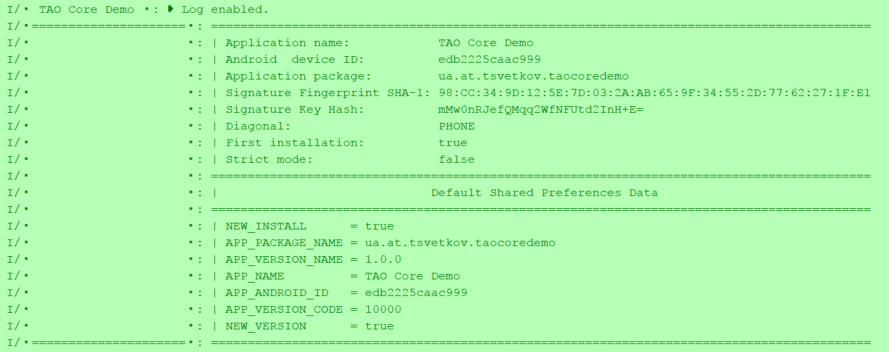

android-tao-core
================

Android App Configurator, Screen dimensions calculator, Units measures converter (mm - cm - inch - pix - pt - twip).

Download from Bintray: [  ](https://bintray.com/lordtao/maven/android-tao-core/_latestVersion)

### AppConfig
Easy access to the basic information about your device and the application. Shows in the log the detailed information.

```java
AppConfig.init(this);
AppConfig.printInfo();
```



Easy work with default Shared preferences:
```java
AppConfig.putSetting(key, isGood);
...
AppConfig.getBoolean(key, true);
```

### Md5:
Calculate Md5 from InputStream, files. Generate a hash String for different data sources.

### Apps
Return installed applications information (Fingerprint, SignatureKeyHash, etc.)

UI utils
--------

### Screen:
Static methods for different screen parameters

### Converter:
Units measures converter

Files utils
-----------

### FileDownloader
Simple file downloader

### FileOperations
Operations with files, assets and dirs - copy/rename/delete/create. Clear the app data.

### FileNameUtil
Operations with file name - extracting, adding, modifying path parts and file extensions.

Add android-tao-core to your project
----------------------------
Android tao core lib is available on Bintray. Please ensure that you are using the latest versions by [  ](https://bintray.com/lordtao/maven/android-tao-core/_latestVersion)

Gradle dependency for your Android app:

add to general build.gradle
```
buildscript {
    repositories {
        jcenter()
        maven {
            url  "http://dl.bintray.com/lordtao/maven"
        }
    }
    dependencies {
        classpath 'com.android.tools.build:gradle:2.0.0-alpha8'
    }
}

allprojects {
    repositories {
        jcenter()
        maven {
            url  "http://dl.bintray.com/lordtao/maven"
        }
    }
}
```
add to your module build.gradle
```
    compile 'ua.at.tsvetkov:taocore:1.3.5'
```

Changelog
---------
#### 1.4.2 -- Kotlin refactoring
* Kotlin refactoring
* fixed hashString for HashUtils

#### 1.4.1 -- Added Demo
* refactoring.
* added Demo

#### 1.4.0 -- refactoring
* refactoring.
* fields validator moved in the separate project.
* convert to Kotlin.

#### 1.3.5 -- removed Log module
* removed Log module. [See separate project - android-tao-log](https://github.com/lordtao/android-tao-log)