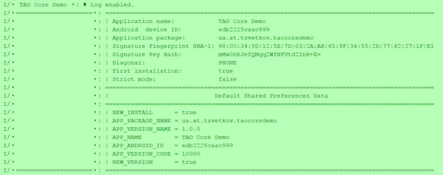

taocore
================

[](https://jitpack.io/#lordtao/android-tao-core)

Core App utility: App Info (Fingerprint, SignatureKeyHash, etc.), Screen dimensions, SharedPreferences easy access, Units converter (mm/cm/inch/pix/pt/twip), MD5, etc.

[Download the latest release](https://github.com/lordtao/android-tao-core/releases)

Application utils
-----------------

### AppConfig
Easy access to the basic information about your device and the application. Shows in the log the detailed information.

```
AppConfig.init(this);
AppConfig.printInfo();
```



Easy work with default Shared preferences:
```
AppConfig.putSetting(key, isGood);
...
AppConfig.getBoolean(key, true);
```

### Apps
Returns information about applications installed on the device (Fingerprint, SignatureKeyHash, etc.)

### Md5:
Calculate Md5 from InputStream, files. Generate a hash String for different data sources.

UI utils
--------

### Screen
Static methods for different screen parameters

### Converter
Units measures converter

Files utils
-----------

### FileDownloader
Simple file downloader

### FileOperations
Operations with files, assets and dirs - copy/rename/delete/create. Clear the app data.

### FileNameUtil
Operations with file name - extracting, adding, modifying path parts and file extensions.

Add android-tao-core to your project
----------------------------

Step 1. Add the JitPack repository to your build file

```
dependencyResolutionManagement {
        repositoriesMode.set(RepositoriesMode.FAIL_ON_PROJECT_REPOS)
        repositories {
            mavenCentral()
            maven { url = uri("https://jitpack.io") }
        }
    }
```

Step 2. Add the dependency

```
dependencies {
            implementation("com.github.lordtao:android-tao-core:latestVersion")
    }
```

Changelog
---------

#### v1.6.124 -- Refactoring
* fixing
* added extensions and bindings classes

#### 1.6.119 -- Refactoring
* fixing
* added extensions and bindings classes 

#### 1.5.0 -- Refactoring
* Gradle version update
* Kotlin version update
* fixing

#### 1.4.5 -- Fixed Kotlin access to some methods
* fixing

#### 1.4.1 -- Added Demo
* refactoring.
* added Demo

#### 1.4.0 -- refactoring
* refactoring.
* fields validator moved in the separate project.
* convert to Kotlin.

#### 1.3.5 -- removed Log module
* removed Log module. [See separate project - android-tao-log](https://github.com/lordtao/android-tao-log)
