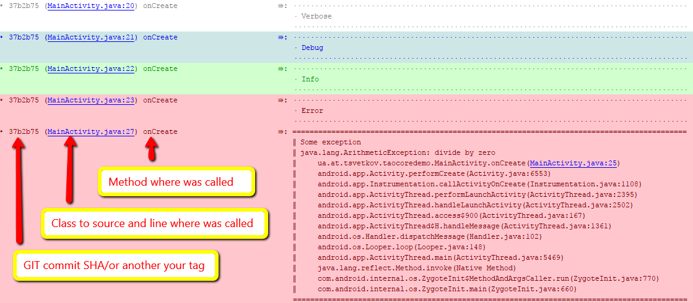

android-tao-core
================

Android App Configurator, easy Log with detailed information, Screen dimensions calculator, Units measures converter (mm - cm - inch - pix - pt - twip).

Download from Bintray: [  ](https://bintray.com/lordtao/maven/android-tao-core/_latestVersion)

##AppConfig:
Easy access to the basic parameters of the application. Print to log detailed app info. Give information about device type (tablet or phone).

```java
AppConfig.init(this);
AppConfig.printInfo();
```

you received in log:


Store some data in Shared preferences:
```java
AppConfig.putSetting(key, isGood);
```
Restore data in Shared preferences:
```java
AppConfig.getBoolean(key, true);
```

##Easy for using and detail Log:

Code example:

```java
   Log.v("Verbose");
   Log.d("Debug");
   Log.i("Info");
   Log.e("Error");
   try{
       int i = 10/0;
   } catch (Exception e) {
       Log.e("Some exception", e);
   }
   try{
       int i = 10/0;
   } catch (Exception e) {
       Log.rt("RuntimeException is not handled by Log.rt()", e);
   }
```

You'll get in your LogCat the lines like below. 
Clicking on the tag brings you to log into the source code of the class which was caused by the logger:



##Screen:
Static methods for different screen parameters

##Converter:
Units measures converter

Add android-tao-core to your project
----------------------------
Android tao core lib is available on Bintray. Please ensure that you are using the latest versions by [  ](https://bintray.com/lordtao/maven/android-tao-core/_latestVersion)

Gradle dependency for your Android app:

add to general build.gradle
```
buildscript {
    repositories {
        jcenter()
        maven {
            url  "http://dl.bintray.com/lordtao/maven"
        }
    }
    dependencies {
        classpath 'com.android.tools.build:gradle:2.0.0-alpha8'
    }
}

allprojects {
    repositories {
        jcenter()
        maven {
            url  "http://dl.bintray.com/lordtao/maven"
        }
    }
}
```
add to your module build.gradle
```
    compile 'ua.at.tsvetkov:taocore:1.2.7'
```
